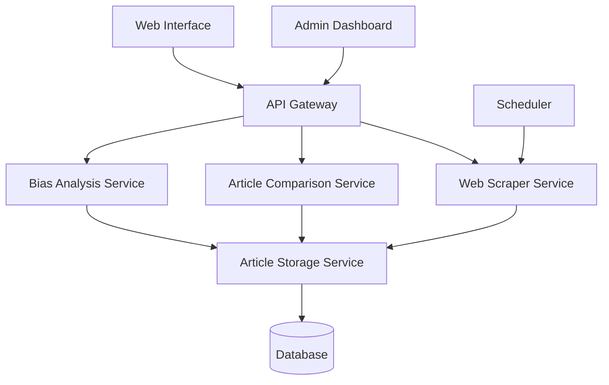

# Design Document

## Overview

The Media Bias Detector is a comprehensive system that scrapes news articles from major Bangladeshi news outlets, analyzes them for bias indicators, and provides comparative analysis through a web interface. The system uses natural language processing to detect sentiment, political bias, and emotional language patterns, with special focus on comparing how different sources report the same stories.

## Architecture

The system follows a microservices architecture with the following main components:



### Core Services

1. **Web Scraper Service**: Handles scraping from news sources
2. **Article Storage Service**: Manages article persistence and deduplication
3. **Bias Analysis Service**: Performs NLP analysis for bias detection
4. **Article Comparison Service**: Groups related articles and calculates bias differences
5. **API Gateway**: Routes requests and handles authentication
6. **Scheduler**: Manages automated scraping tasks

## Components and Interfaces

### Web Scraper Service

**Technology**: Python with Scrapy/BeautifulSoup
**Responsibilities**:
- Extract articles from each news source using custom scrapers
- Handle different website structures and anti-bot measures
- Implement respectful crawling with delays and user-agent rotation
- Extract metadata (title, content, author, date, URL)

**Key Classes**:
```python
class BaseScraper:
    def scrape_articles(self, url: str) -> List[Article]
    def extract_content(self, html: str) -> Article
    def handle_rate_limiting(self) -> None

class ProthomAloScraper(BaseScraper)
class DailyStarScraper(BaseScraper)
class BDPratidinScraper(BaseScraper)
class EkattorTVScraper(BaseScraper)
class ATNNewsScraper(BaseScraper)
```

### Article Storage Service

**Technology**: Python with PyMongo/MongoDB
**Responsibilities**:
- Store articles with proper indexing
- Prevent duplicates using content hashing
- Manage data retention policies
- Provide efficient querying capabilities

**Database Collections**:
```javascript
// articles collection
{
  _id: ObjectId,
  url: String (unique index),
  title: String,
  content: String,
  content_hash: String (unique index),
  author: String,
  publication_date: Date,
  source: String (index),
  scraped_at: Date,
  language: String,
  bias_scores: {
    sentiment_score: Number,
    political_bias_score: Number,
    emotional_language_score: Number,
    factual_vs_opinion_score: Number,
    overall_bias_score: Number,
    analyzed_at: Date
  }
}

// article_groups collection (for similar articles)
{
  _id: ObjectId,
  story_id: String (unique index),
  articles: [ObjectId], // references to articles
  similarity_threshold: Number,
  created_at: Date,
  bias_comparison: {
    source_differences: Object, // source -> percentage difference
    key_differences: [String]
  }
}
```

### Bias Analysis Service

**Technology**: Python with spaCy, NLTK, transformers
**Responsibilities**:
- Analyze sentiment using pre-trained models
- Detect political bias through keyword analysis and language patterns
- Identify emotional language and loaded terms
- Distinguish factual content from opinion

**Key Components**:
```python
class BiasAnalyzer:
    def analyze_sentiment(self, text: str) -> float
    def detect_political_bias(self, text: str) -> float
    def identify_emotional_language(self, text: str) -> float
    def classify_factual_vs_opinion(self, text: str) -> float
    def calculate_overall_bias(self, scores: dict) -> float

class BengaliNLPProcessor:
    def preprocess_bengali_text(self, text: str) -> str
    def extract_bengali_features(self, text: str) -> dict

class EnglishNLPProcessor:
    def preprocess_english_text(self, text: str) -> str
    def extract_english_features(self, text: str) -> dict
```

### Article Comparison Service

**Technology**: Python with scikit-learn, sentence-transformers
**Responsibilities**:
- Group related articles using content similarity
- Calculate bias percentage differences between sources
- Generate comparative analysis reports

**Key Classes**:
```python
class ArticleComparator:
    def find_similar_articles(self, article: Article) -> List[Article]
    def calculate_bias_differences(self, articles: List[Article]) -> dict
    def generate_comparison_report(self, article_group: List[Article]) -> ComparisonReport

class ContentSimilarityMatcher:
    def calculate_similarity(self, text1: str, text2: str) -> float
    def group_by_similarity(self, articles: List[Article]) -> List[List[Article]]
```

### Web Interface

**Technology**: React.js with TypeScript
**Responsibilities**:
- Display bias analysis dashboard
- Show comparative analysis between sources
- Provide filtering and search capabilities
- Visualize bias trends and statistics

**Key Components**:
- Dashboard with source-wise bias statistics
- Article comparison view with percentage differences
- Individual article analysis with highlighted bias indicators
- Admin panel for configuration and monitoring

## Data Models

### Article Model
```python
@dataclass
class Article:
    id: Optional[str]  # MongoDB ObjectId
    url: str
    title: str
    content: str
    content_hash: str
    author: Optional[str]
    publication_date: datetime
    source: str
    scraped_at: datetime
    language: str
    bias_scores: Optional['BiasScore'] = None
```

### Bias Score Model
```python
@dataclass
class BiasScore:
    sentiment_score: float  # -1 (negative) to 1 (positive)
    political_bias_score: float  # -1 (left) to 1 (right)
    emotional_language_score: float  # 0 (neutral) to 1 (highly emotional)
    factual_vs_opinion_score: float  # 0 (opinion) to 1 (factual)
    overall_bias_score: float  # 0 (unbiased) to 1 (highly biased)
    analyzed_at: datetime
```

### Comparison Report Model
```python
@dataclass
class ComparisonReport:
    story_id: str
    articles: List[Article]
    bias_differences: Dict[str, float]  # source -> percentage difference
    key_differences: List[str]
    similarity_scores: Dict[Tuple[str, str], float]
```

## Error Handling

### Scraping Errors
- **Rate Limiting**: Implement exponential backoff and retry mechanisms
- **Website Structure Changes**: Log failures and send admin notifications
- **Network Issues**: Retry with different user agents and proxy rotation
- **Content Extraction Failures**: Skip problematic articles and continue processing

### Analysis Errors
- **Language Detection Failures**: Default to Bengali processing with fallback to English
- **Model Loading Issues**: Implement graceful degradation with simpler analysis methods
- **Memory Issues**: Process articles in batches with configurable batch sizes

### Data Storage Errors
- **Duplicate Detection**: Use content hashing to prevent duplicates
- **Database Connection Issues**: Implement connection pooling and retry logic
- **Storage Capacity**: Implement automated cleanup of old articles based on retention policies

## Testing Strategy

### Unit Testing
- Test individual scrapers with mock HTML responses
- Test bias analysis algorithms with known biased/unbiased text samples
- Test article comparison logic with similar/dissimilar article pairs
- Test data models and database operations

### Integration Testing
- Test end-to-end scraping workflow from URL to database storage
- Test complete bias analysis pipeline from raw text to bias scores
- Test API endpoints with various input scenarios
- Test web interface functionality with different user interactions

### Performance Testing
- Load testing for concurrent scraping operations
- Performance testing for bias analysis with large text volumes
- Database query performance testing with large article datasets
- Web interface responsiveness testing

### Monitoring and Logging
- Scraping success/failure rates by source
- Analysis processing times and accuracy metrics
- API response times and error rates
- Database performance and storage usage
- User interaction patterns and feature usage